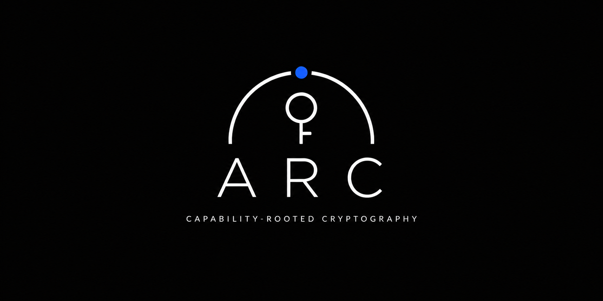

# ARC: Authenticated Routing Chain

<em>Capability routed Encryption</em>

  

ARC is an encryption scheme where opening ciphertext requires these two things to be true in order to safely decrypt:

a) correct key material  
b) valid, non-revoked authority capability proof

ARC seals bytes to an authority state (root, policy, rights, object, epoch, revocation), so decryption succeeds only when key possession and current authority are both cryptographically true.

## Core property

Traditional encryption works by decrypting if the key is valid. Whereas ARC in the core of the encryption mechanism will only decrypt if the key is valid AND capability proof is valid for this exact authority context

## Current architecture 

ARC uses a two-layer design:

1. Payload layer:
	- DEK <- random 256-bit key
	- C_payload = AEAD.Enc(DEK, payload)
2. Authority layer:
	- KEK_e = KDF(shared_secret, authority_context_e)
	- WrappedDEK_e = AEAD.Enc(KEK_e, DEK, authority_AAD)

This keeps authority cryptographically required for opening while allowing rewrapping across epochs without rewriting large payloads.

## Threat-model honesty

ARC is designed to block:

- key-only access without valid authority
- authority-only access without recipient key material
- cross-object capability misuse
- stale capability replay (under current-authority policy)

ARC does not claim to block:

- recipient secret compromise plus valid capability compromise
- malicious authorized decryptor exfiltration
- full threshold-authority compromise
- endpoint compromise after successful decryption

## Status

Draft cryptographic construction and security model with hardening updates.
Built from standard primitives (AEAD, KDF, Merkle commitments, signatures, KEM/hybrid KEM, transparency proofs, threshold signatures).

## Rust development status

This repository now includes an in-progress Rust library scaffold (`arc_core`) intended for iterative hardening and testing before any publishing decision.

Current implementation focus:

- capability validation and authority-state checks
- temporal policy handling
- payload encryption via random DEK
- authority-bound DEK wrappers via HKDF-derived KEK
- epoch rewrap support for current-authority opening
- canonical transcript and AAD field framing
- pluggable authority verifier interfaces

Current module layout:

- `src/arc/model.rs` data model and context hashing
- `src/arc/engine.rs` seal/open/rewrap pipeline
- `src/arc/verify.rs` authority verification traits and default verifier
- `src/encoding/codec.rs` canonical field encoding helpers
- `src/core/temporal.rs` temporal open policies
- `src/core/rights.rs` rights bitset model
- `src/core/error.rs` library error types
- `src/lib.rs` public re-exports and crate surface

## Local development commands

- `cargo test` to run unit tests
- `cargo fmt` to format code
- `cargo clippy --all-targets --all-features -D warnings` for linting

## Test organization

- `tests/arc_flow.rs` integration tests for successful seal/open and rewrap flows
- `tests/arc_guards.rs` integration tests for rejection and tamper scenarios
- `tests/helpers/state.rs` authority-state fixtures
- `tests/helpers/capability.rs` capability and proof fixtures
- `tests/helpers/request_builders.rs` request builders and policy-hash helpers
- `tests/helpers/scenario.rs` small builder-style scenario composition helpers for expressive test setup

## Publication posture

Not ready for publication.

The current goal is correctness, adversarial testing, and interface stabilization first. Crate metadata and publishing workflow can be enabled once cryptographic review and test coverage targets are met.
